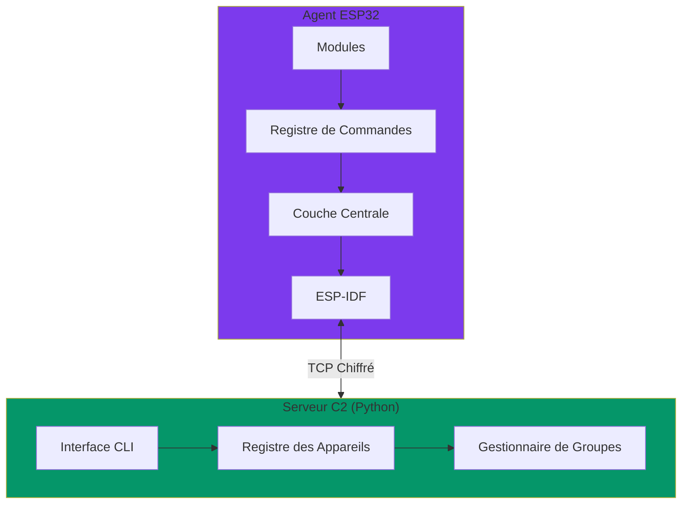

# Espilon

Framework d'Agents Embarqués ESP32 pour la Recherche en Sécurité

Créez des agents embarqués puissants et légers pour la surveillance réseau, la reconnaissance et la communication IoT distribuée. Open-source, modulaire et conçu pour les professionnels de la sécurité.

[Commencer :material-rocket-launch:](getting-started/quickstart.md){ .md-button .md-button--primary }
[Voir l'Architecture :material-graph:](getting-started/architecture.md){ .md-button }

---

## Qu'est-ce qu'Espilon ?

Espilon démontre comment construire des agents embarqués légers et efficaces capables de communiquer via Wi-Fi ou GPRS. Construit avec ESP-IDF et conçu pour la recherche en sécurité et l'éducation.

!!! warning "Outil de Recherche en Sécurité"
    Ceci est un outil de recherche en sécurité et d'éducation. Il doit uniquement être utilisé dans des **tests d'intrusion autorisés**, des environnements contrôlés, des compétitions CTF ou des contextes éducatifs. L'utilisation non autorisée est illégale.

## Fonctionnalités Clés

### Capacités Principales

- **Double Backend Réseau** - Connectivité WiFi ou GPRS (support LilyGO T-Call)
- **C2 Chiffré** - Chiffrement ChaCha20 avec Protocol Buffers
- **Architecture Modulaire** - Activer/désactiver les composants à la compilation
- **Exécution Asynchrone** - Gestion des tâches basée sur FreeRTOS
- **Reconnexion Automatique** - TCP persistant avec récupération
- **Multi-dispositifs** - C2 centralisé pour la gestion de flotte

### Modules

=== "Réseau"
    - Scanner ARP
    - Ping ICMP
    - Proxy TCP
    - Renifleur de paquets
    - Générateur de trafic

=== "FakeAP"
    - Point d'accès malveillant
    - Portail captif
    - Détournement DNS
    - Suivi des clients

=== "Reconnaissance"
    - Support ESP32-CAM
    - Capture d'image
    - Streaming vidéo
    - Trilatération BLE (en développement)

=== "Système"
    - Gestion des appareils
    - Moniteur mémoire
    - Suivi du temps de fonctionnement
    - Redémarrage à distance

## Liens Rapides

-   :material-rocket-launch:{ .lg .middle } **Démarrage**

    ---

    Installez Espilon et construisez votre premier agent

    [:octicons-arrow-right-24: Démarrage Rapide](getting-started/quickstart.md)

-   :material-chip:{ .lg .middle } **Guide Matériel**

    ---

    Cartes supportées, brochages et câblage

    [:octicons-arrow-right-24: Matériel](hardware/index.md)

-   :material-code-braces:{ .lg .middle } **API des Modules**

    ---

    Référence complète des commandes

    [:octicons-arrow-right-24: Modules](modules/index.md)

-   :material-shield-lock:{ .lg .middle } **Sécurité**

    ---

    Bonnes pratiques et utilisation responsable

    [:octicons-arrow-right-24: Sécurité](security/index.md)

## Vue d'Ensemble de l'Architecture

## Matériel Supporté

### Cartes Recommandées

| Carte | Type | Statut | Idéal Pour |
|-------|------|--------|------------|
| **LilyGO T-Call** | GPRS | ✅ Recommandé | Déploiements GPRS portables |
| ESP32 DevKit | WiFi | ✅ Supporté | Opérations WiFi générales |
| ESP32-CAM | Caméra | ✅ Supporté | Vision/surveillance |
| NodeMCU-32S | WiFi | ✅ Supporté | Développement |

[Voir le guide matériel complet →](hardware/index.md)

## Pourquoi Espilon ?

### Pour les Chercheurs en Sécurité

- Comprendre les vecteurs d'attaque IoT embarqués
- Tester les contrôles de sécurité sans fil
- Démontrer des concepts de sécurité
- Développer des modules personnalisés

### Pour les Éducateurs

- Enseigner la sécurité des systèmes embarqués
- Labs pratiques de sécurité WiFi
- Cours de test d'intrusion IoT
- Plateforme d'apprentissage pratique

### Pour les Développeurs

- Apprendre le développement ESP32
- Comprendre l'architecture C2
- Construire des modules personnalisés
- Contribuer à l'open source

## Statut du Projet

| Composant | Statut | Version |
|-----------|--------|---------|
| Firmware | ✅ Stable | v1.0 |
| Serveur C2 | ✅ Stable | v1.0 |
| Documentation | ✅ Complète | v1.0 |
| LilyGO T-Call | ✅ Officiel | v1.0 |

## Obtenir de l'Aide

- **Documentation** : Parcourez les guides dans la navigation
- **Issues GitHub** : [Signaler des bugs](https://github.com/Espilon-Net/espilon/issues)
- **Discussions** : [Q&A Communautaire](https://github.com/Espilon-Net/espilon/discussions)

## Licence

Espilon est sous licence [MIT License](about/license.md) avec des termes additionnels pour les outils de recherche en sécurité.

---

!!! tip "Prochaines Étapes"
    Prêt à commencer ? Consultez le [Guide de Démarrage Rapide](getting-started/quickstart.md) ou explorez les [Options Matérielles](hardware/index.md).
