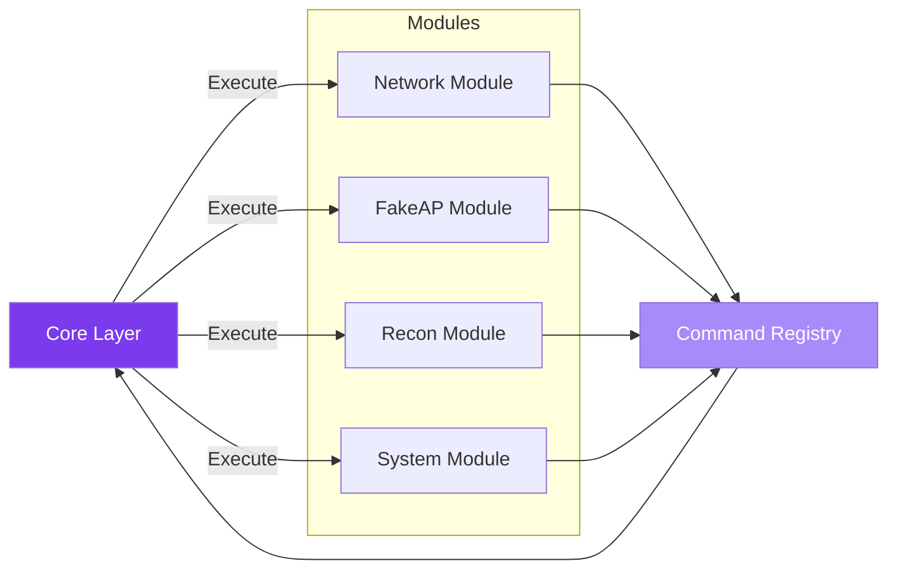
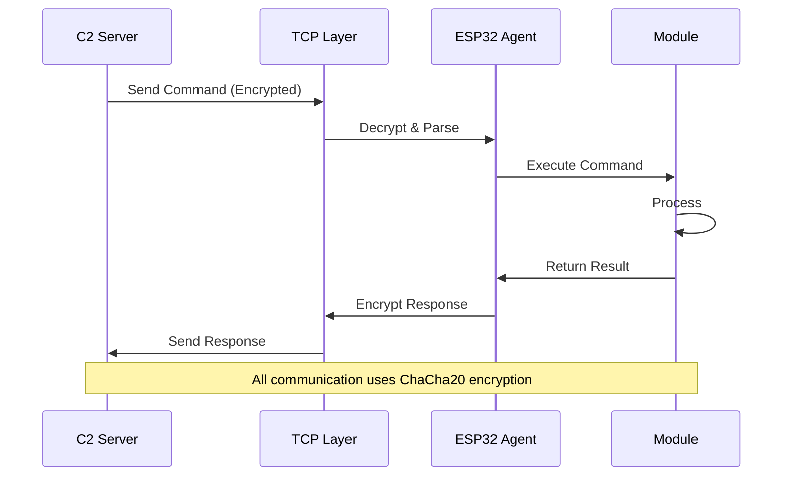
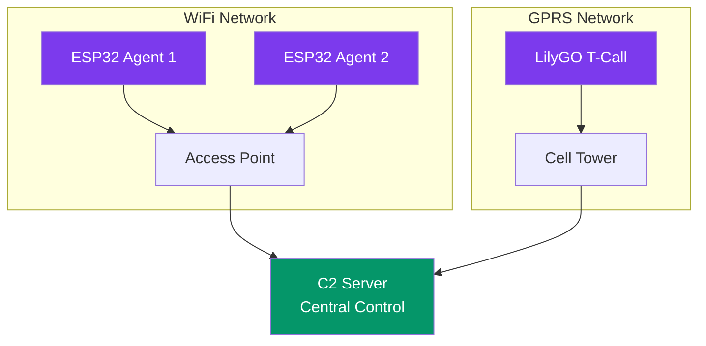
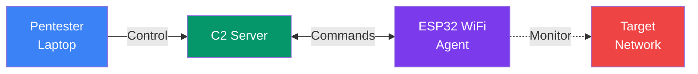
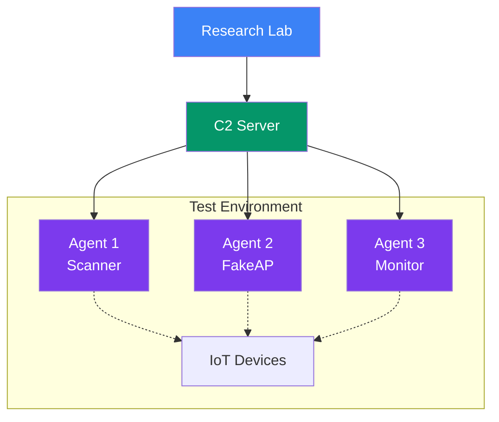
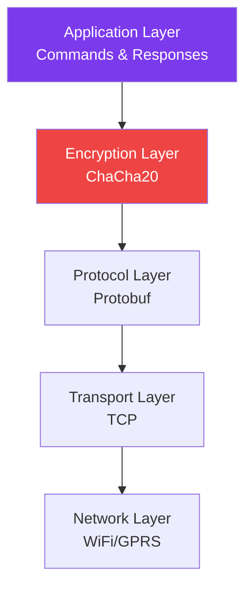

# Architecture Overview

This page explains the Espilon architecture and how components interact.

## System Architecture

```mermaid
graph TB
    subgraph "ESP32 Device"
        FW[Firmware]
        MOD[Modules]
        NET[Network Layer]
        ENC[Encryption]
    end

    subgraph "Communication"
        TCP[TCP Connection]
        PROTO[Protocol Buffers]
    end

    subgraph "C2 Server"
        CLI[CLI Interface]
        MGR[Device Manager]
        DB[(Device Registry)]
    end

    FW --> MOD
    MOD --> NET
    NET --> ENC
    ENC <-->|ChaCha20| TCP
    TCP <-->|Protobuf| PROTO
    PROTO <--> CLI
    CLI --> MGR
    MGR --> DB

    style "ESP32 Device" fill:#7c3aed,color:#fff
    style "C2 Server" fill:#059669,color:#fff
    style "Communication" fill:#3b82f6,color:#fff
```

## Module System



## Communication Flow



## Network Topology



## Deployment Scenarios

### Scenario 1: WiFi Penetration Testing



### Scenario 2: IoT Security Research



## Component Responsibilities

| Component | Responsibility | Technology |
|-----------|---------------|------------|
| **Firmware** | Device logic, module execution | C/ESP-IDF |
| **Modules** | Specific capabilities (scanning, recon, etc.) | C/ESP-IDF |
| **Network Layer** | WiFi/GPRS connectivity | ESP-IDF WiFi/SIM800 |
| **Encryption** | Secure communication | ChaCha20 |
| **Protocol** | Message serialization | Protocol Buffers |
| **C2 Server** | Command & control interface | Python 3 |
| **Device Manager** | Fleet management | Python 3 |

## Security Layers



## Next Steps

- [Installation Guide](installation.md) - Set up your development environment
- [Hardware Guide](../hardware/index.md) - Choose your ESP32 board
- [Module Reference](../modules/index.md) - Learn about available modules
