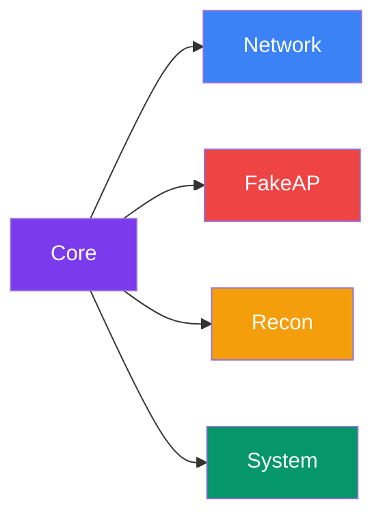
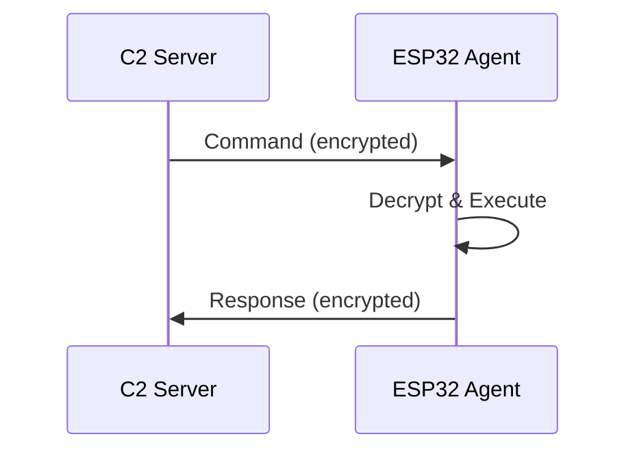
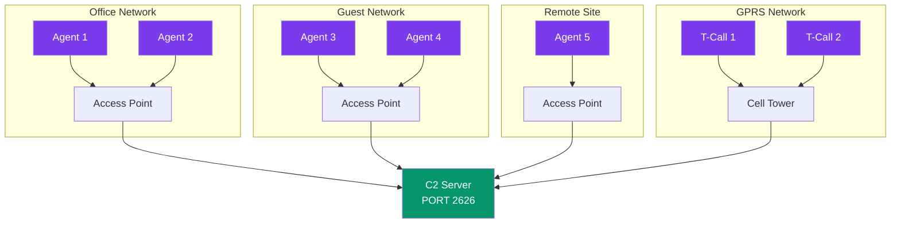
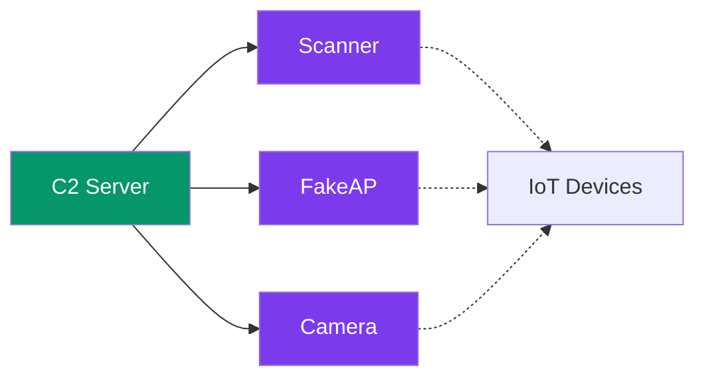

# Architecture Overview

This page explains how Espilon works and how all components interact together.

---

## System Architecture

Espilon follows a simple client-server model. ESP32 agents connect to a central C2 server over the internet. All communications are encrypted using ChaCha20 and serialized with Protocol Buffers.


**How it works:**

1. The ESP32 agent boots and connects to the configured WiFi or GPRS network
2. It establishes a TCP connection to the C2 server on port 2626
3. All messages are encrypted with ChaCha20 before transmission
4. The C2 server sends commands, the agent executes them and returns results

---

## Module System

Espilon uses a modular architecture. Each module adds specific capabilities and can be enabled or disabled at compile time via `menuconfig`. This allows you to create lightweight agents with only the features you need.



### Available Modules

| Module | Description | Key Commands |
|--------|-------------|--------------|
| **System** | Basic device management | `system_uptime`, `system_mem`, `reboot` |
| **Network** | Network scanning and analysis | `arp_scan`, `ping`, `tcp_proxy` |
| **FakeAP** | Rogue access point creation | `fakeap_start`, `fakeap_stop`, `captive_portal` |
| **Recon** | Visual recon & BLE tracking | `capture`, `stream_start`, `ble_trilat` |

### Configuration Examples

You can enable only the modules you need. Here are some common configurations:

**Minimal Agent (network scanning only):**

```text
[X] System Module    -> Always enabled
[X] Network Module   -> For arp_scan, ping
[ ] FakeAP Module    -> Disabled
[ ] Recon Module     -> Disabled
```

**FakeAP Agent (rogue access point):**

```text
[X] System Module    -> Always enabled
[ ] Network Module   -> Disabled
[X] FakeAP Module    -> For creating rogue APs
[ ] Recon Module     -> Disabled
```

**Camera Agent (ESP32-CAM):**

```text
[X] System Module    -> Always enabled
[ ] Network Module   -> Disabled
[ ] FakeAP Module    -> Disabled
[X] Recon Module     -> For photo/video capture
```

**Full Agent (all features):**

```text
[X] System Module    -> Always enabled
[X] Network Module   -> Network scanning
[X] FakeAP Module    -> Rogue AP
[X] Recon Module     -> Camera (ESP32-CAM only)
```

!!! tip "Memory Optimization"
    Disabling unused modules reduces firmware size and frees RAM for operations. A minimal agent uses ~30% less memory than a full agent.

---

## Communication Flow

Here's how a command flows from the C2 server to the agent and back:



**Step by step:**

1. **C2 sends command** - The operator types a command (e.g., `arp_scan 192.168.1.0/24`)
2. **Encryption** - The command is serialized with Protobuf and encrypted with ChaCha20
3. **Transmission** - Sent over TCP to the agent
4. **Agent receives** - Decrypts the message and parses the command
5. **Execution** - The appropriate module executes the command
6. **Response** - Results are encrypted and sent back to C2

---

## Network Topology

Espilon supports deploying multiple agents across different networks. All agents connect back to the same C2 server, allowing centralized control of your entire fleet.



**Key points:**

- **WiFi agents** connect through local access points
- **GPRS agents** (LilyGO T-Call) connect through cellular networks
- **All agents** report to the same C2 server on port 2626
- **Mixed deployments** are fully supported

---

## Deployment Scenarios

### Scenario 1: WiFi Penetration Testing

Deploy an agent on the target network to perform reconnaissance from the inside.


**Use case:** The pentester controls the C2 server remotely. The ESP32 agent is placed inside the target network and performs ARP scans, packet sniffing, and other reconnaissance tasks.

### Scenario 2: IoT Security Research

Deploy multiple agents to test IoT device security in a lab environment.



**Use case:** Each agent has a different role - one scans the network, one creates a rogue AP to test client behavior, and one monitors with a camera.

---

## Security Layers

All Espilon communications pass through multiple security layers:


| Layer | Purpose | Technology |
|-------|---------|------------|
| **Application** | Commands and responses | Custom protocol |
| **Encryption** | Confidentiality | ChaCha20 (256-bit key) |
| **Serialization** | Efficient encoding | Protocol Buffers |
| **Transport** | Reliable delivery | TCP |
| **Network** | Connectivity | WiFi / GPRS |

!!! warning "Key Security"
    The encryption is only as strong as your key management. Never use default keys in production. Generate unique keys for each deployment.

---

## Component Summary

| Component | Role | Technology |
|-----------|------|------------|
| **ESP32 Agent** | Executes commands in the field | C / ESP-IDF |
| **C2 Server** | Central command & control | Python 3 |
| **Encryption** | Secures all communications | ChaCha20 |
| **Protocol** | Message serialization | Protocol Buffers |
| **WiFi** | Local network connectivity | ESP-IDF WiFi |
| **GPRS** | Cellular connectivity | SIM800L |

---

## Next Steps

- [Quick Start](quickstart.md) - Build and flash your first agent
- [Installation Guide](installation.md) - Set up your development environment
- [Hardware Guide](../hardware/index.md) - Choose your ESP32 board
- [Module Reference](../modules/index.md) - Learn about available commands
