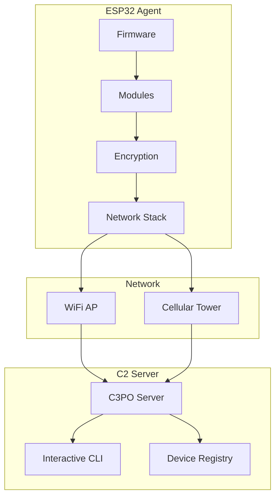

# Overview

**Espilon** is an ESP32-based embedded agent framework designed for security research, penetration testing, and IoT experimentation.

## What is Espilon?

Espilon transforms affordable ESP32 microcontrollers into powerful networked agents that can:

- Connect to a Command & Control (C2) server via WiFi or GPRS
- Execute commands remotely through an encrypted channel
- Perform network reconnaissance and security testing
- Create fake access points and captive portals
- Operate autonomously on battery power

## Key Features

### Dual Network Modes

- **WiFi Mode**: Standard 802.11 b/g/n connectivity
- **GPRS Mode**: 2G cellular connectivity for remote deployments (LilyGO T-Call)

### Modular Architecture

Enable only the features you need:

- **System Module**: Basic device control and file operations
- **Network Module**: Network scanning, packet injection, proxy
- **FakeAP Module**: Rogue access points and captive portals
- **Recon Module**: Advanced reconnaissance (camera, BLE tracking)

### Secure Communication

- ChaCha20 stream cipher encryption
- Protocol Buffers for efficient data transfer
- Configurable encryption keys per deployment

### Low Power Operation

- Deep sleep support for battery conservation
- Runtime: 5-14 hours on Li-Po battery (depending on activity)
- Power management via IP5306 IC

## Use Cases

!!! warning "Authorized Use Only"
    Espilon is designed for authorized security testing, research, and educational purposes only. Always obtain proper authorization before deployment.

### Penetration Testing

- WiFi network assessments
- IoT device security audits
- Physical security testing
- Red team operations

### Research & Education

- Network protocol analysis
- Embedded systems security
- Wireless communication research
- Cybersecurity training labs

### IoT Development

- Remote sensor networks
- Environmental monitoring
- Asset tracking
- Proof-of-concept prototypes

## Architecture Overview

## System Requirements

### For Firmware Development

- ESP-IDF v5.3.2
- Python 3.8+
- USB-to-UART drivers
- 2GB free disk space

### For C2 Server

- Python 3.8+
- Linux/macOS (Windows via WSL2)
- Network access to agents

### Hardware

- ESP32 development board (any variant)
- LilyGO T-Call for GPRS mode
- USB-C cable
- Optional: Li-Po battery, external antenna

## Quick Comparison

| Feature | WiFi Mode | GPRS Mode |
|---------|-----------|-----------|
| **Range** | 50-100m | Nationwide |
| **Speed** | Up to 150 Mbps | ~50 Kbps |
| **Latency** | Low (~10ms) | Medium (~500ms) |
| **Cost** | Free (existing WiFi) | SIM card + data plan |
| **Setup** | Simple | Requires SIM, APN config |
| **Best For** | Labs, buildings | Remote, mobile |

## Project Status

Espilon is actively maintained and used for:

- Educational security labs
- IoT penetration testing
- Security research projects
- Cybersecurity competitions (CTF)

## Getting Started

Ready to build your first Espilon agent?

1. [Quick Start Guide](quickstart.md) - Get up and running in 15 minutes
2. [Installation](installation.md) - Detailed setup instructions
3. [Hardware Guide](../hardware/index.md) - Choose your ESP32 board

## Community & Support

- **GitHub**: [Report issues and contribute](https://github.com/yourusername/epsilon)
- **Documentation**: This MkDocs site
- **License**: MIT (see [License](../about/license.md))

---

**Next**: [Quick Start](quickstart.md) | [Installation Guide](installation.md)
