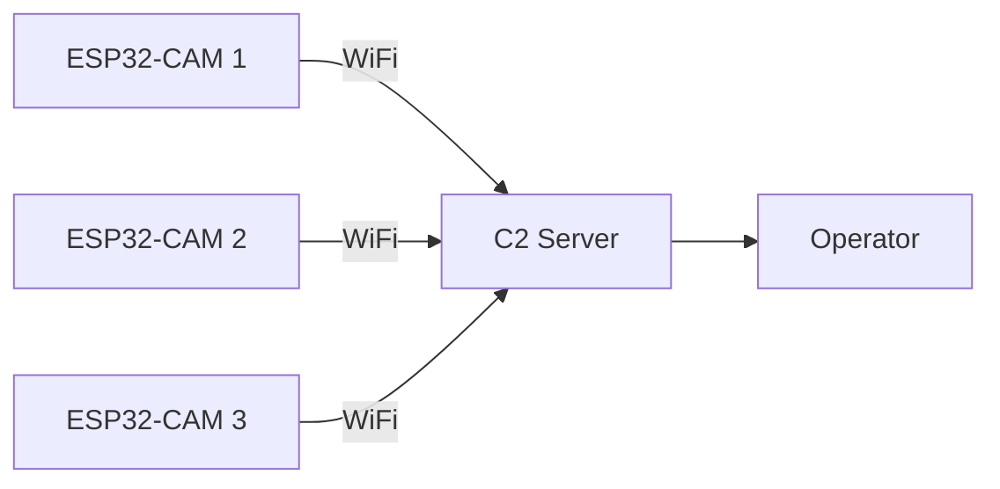

# ESP32-CAM

The **ESP32-CAM** enables visual reconnaissance capabilities for Espilon agents.

## Overview

The ESP32-CAM is an ESP32 module with an integrated OV2640 camera sensor, providing:

- 2MP image capture
- Video streaming
- Motion detection
- SD card storage
- Built-in LED flash

!!! info "Recon Module Required"
    Camera features require the Recon module to be enabled at compile time.

## Specifications

| Component | Specification |
|-----------|---------------|
| **MCU** | ESP32-S (240MHz dual-core) |
| **Flash** | 4MB |
| **PSRAM** | 4MB (required for camera) |
| **Camera** | OV2640 (2MP) |
| **Resolution** | Up to 1600x1200 (UXGA) |
| **SD Card** | MicroSD slot (up to 4GB) |
| **LED** | Built-in flash LED (GPIO 4) |
| **Price** | ~$8-15 USD |

## Supported Boards

### AI-Thinker ESP32-CAM

The most common and recommended variant:

```
┌─────────────────────────────────────────────┐
│  [OV2640 Camera]                            │
│      ┌───┐                                  │
│      │   │                                  │
│      └───┘                                  │
│                                             │
│  ┌───────────────────────────────────────┐  │
│  │            ESP32-S Module             │  │
│  │                                       │  │
│  │  [Antenna]                            │  │
│  └───────────────────────────────────────┘  │
│                                             │
│  [SD Card Slot]        [Flash LED]          │
│                                             │
│  GND 3V3 U0R U0T GND VCC                   │
│   │   │   │   │   │   │                    │
└───┴───┴───┴───┴───┴───┴────────────────────┘
```

### M5Stack ESP32 Camera

Alternative with better form factor:

- Built-in battery holder
- Grove connector
- Better antenna design
- Higher price (~$20)

## Pinout

### AI-Thinker ESP32-CAM

| Pin | Function | Notes |
|-----|----------|-------|
| **5V/VCC** | Power input | 5V recommended |
| **GND** | Ground | |
| **U0T** | UART TX | For flashing |
| **U0R** | UART RX | For flashing |
| **GPIO 0** | Boot mode | Pull LOW to flash |
| **GPIO 4** | Flash LED | Active HIGH |
| **GPIO 33** | Red LED | Active LOW |

### Camera Pins (Internal)

These are fixed and cannot be changed:

| GPIO | Camera Function |
|------|-----------------|
| 32 | PWDN |
| 0 | RESET |
| 5 | XCLK |
| 18 | SIOD |
| 23 | SIOC |
| 36 | Y9 |
| 37 | Y8 |
| 38 | Y7 |
| 39 | Y6 |
| 35 | Y5 |
| 34 | Y4 |
| 21 | Y3 |
| 19 | Y2 |
| 22 | VSYNC |
| 25 | HREF |
| 26 | PCLK |

### SD Card Pins

| GPIO | SD Function |
|------|-------------|
| 14 | CLK |
| 15 | CMD |
| 2 | DATA0 |
| 4 | DATA1 (shared with Flash LED) |
| 12 | DATA2 |
| 13 | DATA3 |

!!! warning "SD Card and Flash LED Conflict"
    GPIO 4 is shared between the flash LED and SD card DATA1. You cannot use both simultaneously.

### Available GPIOs

Limited GPIOs available for external use:

```
Available: GPIO 1, 3 (UART0), GPIO 12, 13, 14, 15 (if not using SD card)
Reserved: All camera pins, SD card pins
```

## Hardware Setup

### Required Components

- ESP32-CAM module
- USB-to-Serial adapter (FTDI, CP2102, CH340)
- Jumper wires
- 5V power supply (USB or external)

### Wiring for Flashing

Connect USB-to-Serial adapter to ESP32-CAM:

```
USB-Serial          ESP32-CAM
──────────          ─────────
   5V  ────────────── 5V
   GND ────────────── GND
   TX  ────────────── U0R (GPIO 3)
   RX  ────────────── U0T (GPIO 1)

   GND ────────────── GPIO 0 (for flashing only)
```

!!! important "Boot Mode"
    GPIO 0 must be connected to GND during power-up to enter flash mode. Disconnect after flashing.

### Flashing Procedure

1. **Connect GPIO 0 to GND**
2. **Power cycle the board** (disconnect and reconnect power)
3. **Flash the firmware**:
   ```bash
   idf.py -p /dev/ttyUSB0 flash
   ```
4. **Disconnect GPIO 0 from GND**
5. **Power cycle again** to boot normally

### Power Supply

!!! danger "Power Requirements"
    The ESP32-CAM requires stable 5V power. USB-Serial adapters often cannot supply enough current.

Recommended power options:

| Source | Current | Recommended |
|--------|---------|-------------|
| USB-Serial 3.3V | 300mA max | No |
| USB-Serial 5V | 500mA max | Marginal |
| External 5V PSU | 1A+ | Yes |
| USB power bank | 1A+ | Yes |

## ESP-IDF Configuration

### Enable Recon Module

```bash
cd espilon_bot
idf.py menuconfig
```

Navigate to:

```
Espilon Configuration
  ├─ Module Selection
  │   └─ [X] Enable Recon Module
  │
  ├─ Recon Configuration
  │   ├─ Camera Model: AI-Thinker ESP32-CAM
  │   ├─ Default Resolution: VGA (640x480)
  │   ├─ JPEG Quality: 12 (0-63, lower = better)
  │   └─ Enable PSRAM: [X] (required)
  │
  └─ Network Backend
      └─ [X] WiFi (recommended for camera)
```

### Camera Settings

| Setting | Options | Recommendation |
|---------|---------|----------------|
| **Resolution** | QQVGA to UXGA | VGA (640x480) for balance |
| **JPEG Quality** | 0-63 | 10-15 for good quality |
| **Frame Size** | Various | Match resolution |
| **Brightness** | -2 to 2 | 0 (default) |
| **Contrast** | -2 to 2 | 0 (default) |

### Build and Flash

```bash
# Build
idf.py build

# Flash (with GPIO 0 grounded)
idf.py -p /dev/ttyUSB0 flash

# Monitor
idf.py monitor
```

## Commands

### capture

Capture a single image:

```bash
c3po> send cam_agent capture

Response:
{
  "success": true,
  "size": 45320,
  "resolution": "640x480",
  "format": "JPEG",
  "data": "<base64_encoded_image>"
}
```

Save to file:

```bash
c3po> send cam_agent capture --save image.jpg
[*] Image saved to image.jpg (45320 bytes)
```

### capture_settings

Adjust capture settings:

```bash
# Set resolution
c3po> send cam_agent capture_settings resolution VGA

# Set quality (0-63, lower = better)
c3po> send cam_agent capture_settings quality 10

# Enable flash
c3po> send cam_agent capture_settings flash on

# Adjust brightness (-2 to 2)
c3po> send cam_agent capture_settings brightness 1
```

### stream_start

Start video streaming:

```bash
c3po> send cam_agent stream_start

Response:
{
  "success": true,
  "stream_url": "http://192.168.1.42:81/stream",
  "fps": 10
}
```

!!! note "Streaming Bandwidth"
    Video streaming requires significant bandwidth. Use VGA or lower resolution over WiFi.

### stream_stop

Stop video streaming:

```bash
c3po> send cam_agent stream_stop
[*] Stream stopped
```

### motion_detect

Enable motion detection:

```bash
# Start motion detection
c3po> send cam_agent motion_detect start

# With sensitivity (1-100)
c3po> send cam_agent motion_detect start 50

# Stop motion detection
c3po> send cam_agent motion_detect stop
```

When motion is detected, the agent sends an alert:

```json
{
  "type": "motion_alert",
  "timestamp": "2025-01-10T14:30:45Z",
  "image": "<base64_encoded_image>"
}
```

### flash_led

Control the flash LED:

```bash
# Turn on
c3po> send cam_agent flash_led on

# Turn off
c3po> send cam_agent flash_led off

# Flash briefly (for capture)
c3po> send cam_agent flash_led pulse
```

## Use Cases

### Remote Surveillance

Deploy ESP32-CAM agents for visual monitoring:



**Setup:**

1. Configure agents with unique IDs
2. Position cameras at monitoring points
3. Use `capture` for periodic snapshots
4. Use `motion_detect` for event-triggered capture

### Physical Security Assessment

Test physical security controls:

- Identify camera blind spots
- Test motion sensor coverage
- Document access points
- Capture evidence during pentest

### Documentation

Capture visual evidence during assessments:

```bash
# Capture and save with timestamp
c3po> send cam_agent capture --save evidence_$(date +%Y%m%d_%H%M%S).jpg
```

## Performance

### Resolution vs Speed

| Resolution | Pixels | Typical Size | Capture Time |
|------------|--------|--------------|--------------|
| QQVGA | 160x120 | 5-10 KB | ~100ms |
| QVGA | 320x240 | 15-25 KB | ~200ms |
| VGA | 640x480 | 40-60 KB | ~400ms |
| SVGA | 800x600 | 60-80 KB | ~600ms |
| XGA | 1024x768 | 80-120 KB | ~1s |
| UXGA | 1600x1200 | 150-250 KB | ~2s |

### Streaming Performance

| Resolution | FPS (WiFi) | Bandwidth |
|------------|------------|-----------|
| QQVGA | 25-30 | ~500 Kbps |
| QVGA | 15-20 | ~1 Mbps |
| VGA | 8-12 | ~2-3 Mbps |
| SVGA | 5-8 | ~4-5 Mbps |

!!! tip "Optimization"
    For reliable operation, use VGA or lower resolution with quality 12-15.

## Troubleshooting

### Camera Not Detected

**Symptoms:** "Camera init failed" error

**Solutions:**

1. Check PSRAM is enabled in menuconfig
2. Verify camera ribbon cable is secure
3. Try power cycling
4. Check 5V power supply is adequate

```bash
# Verify PSRAM
idf.py menuconfig
# Component config -> ESP32-specific -> Support for external, SPI-connected RAM
```

### Poor Image Quality

**Symptoms:** Blurry, dark, or noisy images

**Solutions:**

1. Clean camera lens
2. Adjust JPEG quality (lower number = better)
3. Adjust brightness/contrast
4. Ensure adequate lighting or use flash

```bash
c3po> send cam_agent capture_settings quality 8
c3po> send cam_agent capture_settings brightness 1
```

### Brownout/Reboot

**Symptoms:** Device reboots during capture or streaming

**Cause:** Insufficient power supply

**Solutions:**

1. Use external 5V 1A+ power supply
2. Add 100uF capacitor across power pins
3. Reduce resolution/quality
4. Disable flash LED

### WiFi Disconnects During Stream

**Symptoms:** Stream drops after a few seconds

**Solutions:**

1. Reduce resolution
2. Reduce frame rate
3. Move closer to access point
4. Use external antenna (if available)

## Limitations

### Hardware Constraints

- Limited GPIOs available
- SD card conflicts with flash LED
- No UART during camera operation
- PSRAM required (not all boards have it)

### Performance Constraints

- Single camera only
- No hardware video encoding
- WiFi bandwidth limits streaming
- Power hungry during capture

### Security Considerations

!!! warning "Operational Security"
    - Camera captures can reveal operator location
    - Streaming traffic is high and detectable
    - Flash LED is visible
    - Consider privacy and legal implications

## Comparison

### ESP32-CAM vs USB Webcam

| Feature | ESP32-CAM | USB Webcam |
|---------|-----------|------------|
| **Standalone** | Yes | No (needs PC) |
| **Remote** | Yes (WiFi) | No |
| **Power** | 5V | USB |
| **Cost** | ~$10 | ~$20+ |
| **Quality** | 2MP | 1080p+ |
| **Form Factor** | Compact | Larger |

### When to Use ESP32-CAM

- Remote/wireless deployment
- Battery-powered operation
- Covert placement
- Budget constraints

### When to Use Alternative

- High quality video needed
- Wired connection available
- PC-based operation acceptable

## Resources

- [AI-Thinker ESP32-CAM Wiki](https://github.com/raphaelbs/esp32-cam-ai-thinker)
- [OV2640 Datasheet](https://www.uctronics.com/download/cam_module/OV2640DS.pdf)
- [ESP32 Camera Driver](https://github.com/espressif/esp32-camera)

---

**Previous**: [LilyGO T-Call](lilygo-tcall.md) | **Back to**: [Hardware Overview](index.md)
