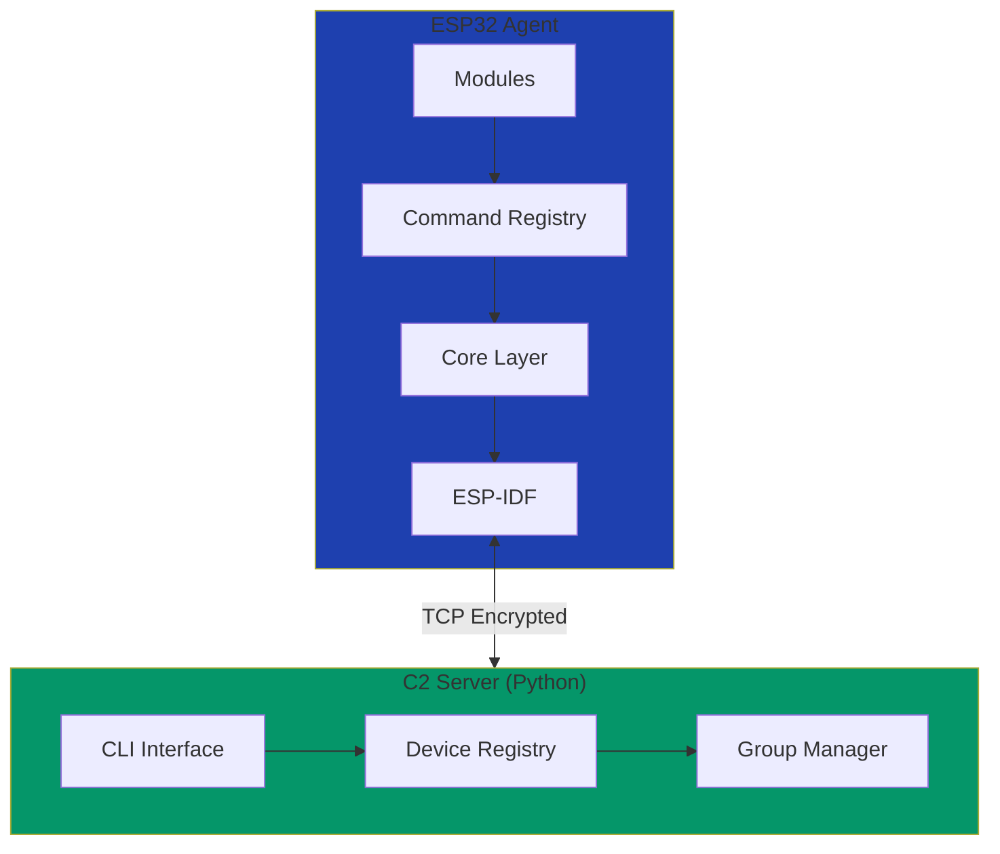

# Espilon

**ESP32 Embedded Agent Framework for Security Research**

Espilon is an open-source embedded agent framework for ESP32 microcontrollers, designed for network surveillance, reconnaissance, and distributed communication in constrained IoT environments.

---

## What is Espilon?

Espilon demonstrates how to build lightweight, efficient embedded agents capable of communicating via Wi-Fi or GPRS. Built with ESP-IDF and designed for security research and education.

!!! warning "Security Research Tool"
    This is a security research and educational tool. It must only be used in **authorized** penetration testing, controlled environments, CTF competitions, or educational contexts. Unauthorized use is illegal.

## Key Features

### Core Capabilities

- **Dual Network Backend** - WiFi or GPRS connectivity (LilyGO T-Call support)
- **Encrypted C2** - ChaCha20 encryption with Protocol Buffers
- **Modular Architecture** - Enable/disable components at compile time
- **Async Execution** - FreeRTOS-based task management
- **Auto-reconnection** - Persistent TCP with recovery
- **Multi-device** - Centralized C2 for fleet management

### Modules

=== "Network"
    - ARP Scanner
    - ICMP Ping
    - TCP Proxy
    - Packet Sniffer
    - Traffic Generator

=== "FakeAP"
    - Rogue Access Point
    - Captive Portal
    - DNS Hijacking
    - Client Tracking

=== "Recon"
    - ESP32-CAM Support
    - Image Capture
    - Video Streaming
    - BLE Trilateration (WIP)

=== "System"
    - Device Management
    - Memory Monitor
    - Uptime Tracking
    - Remote Reboot

## Quick Links

-   :material-rocket-launch:{ .lg .middle } __Getting Started__

    ---

    Install Espilon and build your first agent

    [:octicons-arrow-right-24: Quick Start](getting-started/quickstart.md)

-   :material-chip:{ .lg .middle } __Hardware Guide__

    ---

    Supported boards, pinouts, and wiring

    [:octicons-arrow-right-24: Hardware](hardware/index.md)

-   :material-code-braces:{ .lg .middle } __Module API__

    ---

    Complete command reference

    [:octicons-arrow-right-24: Modules](modules/index.md)

-   :material-shield-lock:{ .lg .middle } __Security__

    ---

    Best practices and responsible use

    [:octicons-arrow-right-24: Security](security/index.md)

## Architecture Overview

## Supported Hardware

### Recommended Boards

| Board | Type | Status | Best For |
|-------|------|--------|----------|
| **LilyGO T-Call** | GPRS | ✅ Recommended | Portable GPRS deployments |
| ESP32 DevKit | WiFi | ✅ Supported | General WiFi operations |
| ESP32-CAM | Camera | ✅ Supported | Vision/surveillance |
| NodeMCU-32S | WiFi | ✅ Supported | Development |

[See complete hardware guide →](hardware/index.md)

## Why Espilon?

### For Security Researchers

- Understand embedded IoT attack vectors
- Test wireless security controls
- Demonstrate security concepts
- Develop custom modules

### For Educators

- Teach embedded systems security
- Practical WiFi security labs
- IoT penetration testing courses
- Hands-on learning platform

### For Developers

- Learn ESP32 development
- Understand C2 architecture
- Build custom modules
- Contribute to open source

## Project Status

| Component | Status | Version |
|-----------|--------|---------|
| Firmware | ✅ Stable | v1.0 |
| C2 Server | ✅ Stable | v1.0 |
| Documentation | ✅ Complete | v1.0 |
| LilyGO T-Call | ✅ Official | v1.0 |

## Getting Help

- **Documentation**: Browse the guides in the navigation
- **GitHub Issues**: [Report bugs](https://github.com/yourusername/epsilon/issues)
- **Discussions**: [Community Q&A](https://github.com/yourusername/epsilon/discussions)

## License

Espilon is licensed under the [MIT License](about/license.md) with additional terms for security research tools.

---

!!! tip "Next Steps"
    Ready to get started? Check out the [Quick Start Guide](getting-started/quickstart.md) or explore the [Hardware Options](hardware/index.md).
