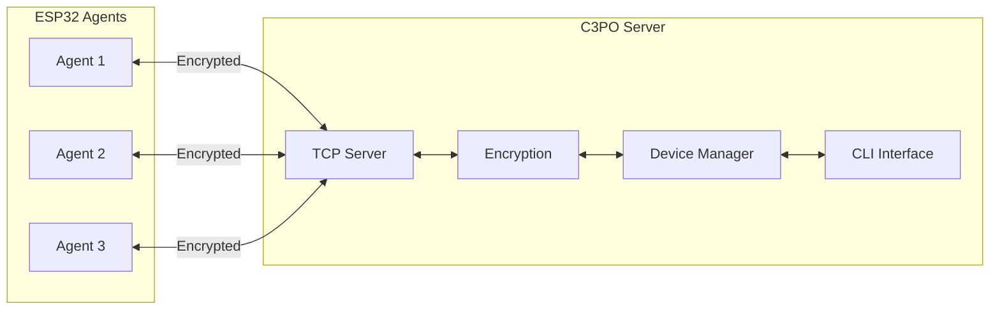
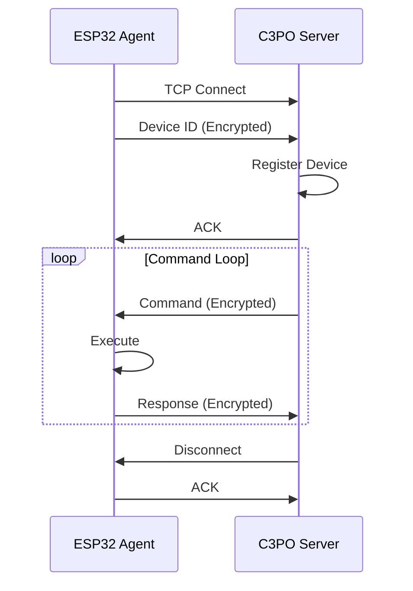

# C2 Server (C3PO)

The Espilon C2 (Command & Control) server manages communication with deployed ESP32 agents.

## Overview

**C3PO** is the primary C2 server for Espilon, providing:

- Asynchronous device management (Python asyncio)
- Interactive CLI interface
- Group-based device organization
- ChaCha20 encrypted communications
- Protocol Buffers message serialization
- Multi-device fleet management
- Real-time command dispatch



## Installation

### Requirements

- Python 3.8+
- pip package manager

### Setup

```bash
# Navigate to C2 directory
cd ~/espilon/tools/c2

# Create virtual environment (recommended)
python3 -m venv venv
source venv/bin/activate

# Install dependencies
pip install -r requirements.txt
```

### Dependencies

The C2 server requires:

| Package | Purpose |
|---------|---------|
| `asyncio` | Asynchronous I/O |
| `protobuf` | Message serialization |
| `pycryptodome` | ChaCha20 encryption |
| `prompt_toolkit` | Interactive CLI |
| `colorama` | Terminal colors |

## Configuration

### Configuration File

Create or edit `config.json`:

```json
{
  "server": {
    "host": "0.0.0.0",
    "port": 2626,
    "max_connections": 100,
    "timeout": 30
  },
  "crypto": {
    "key": "YOUR_32_BYTE_HEX_KEY_HERE_0000000",
    "nonce": "YOUR_12_BYTE_NONCE"
  },
  "logging": {
    "level": "INFO",
    "file": "c3po.log"
  },
  "groups": {
    "default": "ungrouped"
  }
}
```

### Generate Secure Keys

```bash
# Generate 32-byte key (256 bits)
openssl rand -hex 32

# Generate 12-byte nonce
openssl rand -hex 12
```

!!! danger "Key Security"
    - Never use default keys in production
    - Never commit keys to version control
    - Keys must match between C2 and firmware
    - Rotate keys periodically

### Environment Variables

You can also use environment variables:

```bash
export C3PO_HOST="0.0.0.0"
export C3PO_PORT="2626"
export C3PO_KEY="your_hex_key_here"
export C3PO_NONCE="your_nonce_here"
```

## Running the Server

### Basic Start

```bash
python3 c3po.py
```

### With Options

```bash
# Specify port
python3 c3po.py --port 2626

# Specify host and port
python3 c3po.py --host 0.0.0.0 --port 2626

# Verbose logging
python3 c3po.py --verbose

# Use specific config file
python3 c3po.py --config /path/to/config.json
```

### Expected Output

```
  ____  _____  ____   ___
 / ___||___ / |  _ \ / _ \
| |      |_ \ | |_) | | | |
| |___  ___) ||  __/| |_| |
 \____||____/ |_|    \___/

Espilon C2 Server v1.0

[*] Loading configuration...
[*] Encryption initialized
[*] Starting server on 0.0.0.0:2626
[*] Waiting for agents...

c3po>
```

## CLI Commands

### Device Management

#### list

List all connected devices:

```bash
c3po> list

ID           IP               CONNECTED    GROUP        STATUS
--------------------------------------------------------------------------------
ce4f626b     192.168.1.42     2m 34s       default      online
a1b2c3d4     192.168.1.43     15m 12s      scanners     online
f9e8d7c6     10.0.0.15        1h 23m       gprs         online
```

#### select

Select a device to send commands:

```bash
c3po> select ce4f626b
[*] Selected device: ce4f626b (192.168.1.42)

c3po[ce4f626b]>
```

#### info

Get detailed device information:

```bash
c3po> info ce4f626b

Device Information
------------------
ID:          ce4f626b
IP:          192.168.1.42
Connected:   2m 34s
Group:       default
Network:     WiFi
MAC:         AA:BB:CC:DD:EE:FF
Firmware:    1.0.0
Free Memory: 45320 bytes
Uptime:      3h 45m
```

#### disconnect

Disconnect a device:

```bash
c3po> disconnect ce4f626b
[*] Device ce4f626b disconnected
```

### Command Execution

#### send / cmd

Send a command to a device:

```bash
# Long form
c3po> send ce4f626b system_uptime

# Short form (with device selected)
c3po[ce4f626b]> cmd system_uptime

# With arguments
c3po> send ce4f626b ping 8.8.8.8 5
c3po> send ce4f626b arp_scan 192.168.1.0/24
```

#### broadcast

Send command to all devices:

```bash
c3po> broadcast system_uptime
[*] Sending to 3 devices...
[ce4f626b] Uptime: 3h 45m 12s
[a1b2c3d4] Uptime: 15m 30s
[f9e8d7c6] Uptime: 1h 23m 45s
```

### Group Management

#### group create

Create a new group:

```bash
c3po> group create scanners
[*] Group 'scanners' created
```

#### group add

Add device to group:

```bash
c3po> group add ce4f626b scanners
[*] Device ce4f626b added to group 'scanners'
```

#### group remove

Remove device from group:

```bash
c3po> group remove ce4f626b scanners
[*] Device ce4f626b removed from group 'scanners'
```

#### group list

List all groups:

```bash
c3po> group list

GROUP        DEVICES
------------------------
default      1
scanners     2
gprs         1
```

#### group send

Send command to all devices in a group:

```bash
c3po> group send scanners arp_scan 192.168.1.0/24
[*] Sending to 2 devices in group 'scanners'...
```

### Session Management

#### history

Show command history:

```bash
c3po> history

1: list
2: select ce4f626b
3: cmd system_uptime
4: cmd ping 8.8.8.8 5
```

#### clear

Clear the screen:

```bash
c3po> clear
```

#### help

Show available commands:

```bash
c3po> help

Available Commands:
  list                    - List connected devices
  select <id>             - Select a device
  send <id> <cmd> [args]  - Send command to device
  cmd <cmd> [args]        - Send command to selected device
  broadcast <cmd> [args]  - Send to all devices
  group <subcommand>      - Manage device groups
  info <id>               - Show device information
  disconnect <id>         - Disconnect a device
  history                 - Show command history
  clear                   - Clear screen
  exit                    - Exit C3PO
```

#### exit

Exit the C2 server:

```bash
c3po> exit
[*] Shutting down...
[*] Disconnecting 3 devices...
[*] Goodbye!
```

## Protocol

### Message Format

C3PO uses Protocol Buffers for message serialization:

```protobuf
message Command {
    string command_id = 1;
    string command = 2;
    repeated string args = 3;
    int64 timestamp = 4;
}

message Response {
    string command_id = 1;
    bool success = 2;
    string data = 3;
    string error = 4;
    int64 timestamp = 5;
}
```

### Encryption

All communications are encrypted using ChaCha20:

```md
┌─────────────────────────────────────────────┐
│ Plaintext Message (Protobuf)                │
└─────────────────────────────────────────────┘
                    │
                    ▼
┌─────────────────────────────────────────────┐
│ ChaCha20 Encryption (Key + Nonce)           │
└─────────────────────────────────────────────┘
                    │
                    ▼
┌─────────────────────────────────────────────┐
│ Length Prefix (4 bytes) + Ciphertext        │
└─────────────────────────────────────────────┘
                    │
                    ▼
              TCP Socket
```

### Connection Flow



## Advanced Usage

### Scripting

You can script C3PO commands:

```bash
# Create a script file
cat > scan_all.c3po << EOF
list
broadcast system_uptime
group send scanners arp_scan 192.168.1.0/24
EOF

# Run script
python3 c3po.py --script scan_all.c3po
```

### API Integration

C3PO can be imported as a Python module:

```python
from c3po import C3POServer, Device

# Initialize server
server = C3POServer(
    host="0.0.0.0",
    port=2626,
    key="your_key",
    nonce="your_nonce"
)

# Start server
await server.start()

# Send command to device
device = server.get_device("ce4f626b")
response = await device.send_command("system_uptime")
print(response.data)

# Broadcast to all
responses = await server.broadcast("ping", ["8.8.8.8", "5"])
```

### Logging

Enable detailed logging:

```bash
# Debug logging
python3 c3po.py --log-level DEBUG

# Log to file
python3 c3po.py --log-file c3po.log
```

Log format:

```
2025-01-10 14:30:45 [INFO] Device ce4f626b connected from 192.168.1.42
2025-01-10 14:30:46 [DEBUG] Received: system_uptime response
2025-01-10 14:31:00 [INFO] Command sent: ping 8.8.8.8 5
```

## Security Considerations

### Network Security

!!! warning "Firewall Configuration"
    - Only expose C2 port to trusted networks
    - Use VPN for remote access
    - Monitor incoming connections

```bash
# Allow only local network
sudo ufw allow from 192.168.1.0/24 to any port 2626

# Allow specific IP
sudo ufw allow from 203.0.113.50 to any port 2626
```

### Key Rotation

Rotate encryption keys periodically:

1. Generate new keys
2. Update C2 configuration
3. Reflash agents with new keys
4. Restart C2 server

### Audit Trail

C3PO logs all commands for audit:

```bash
# View command log
cat c3po.log | grep "Command sent"

# Export audit report
python3 c3po.py --export-audit audit_report.json
```

## Troubleshooting

### Connection Issues

??? question "Agent won't connect"
    **Checks:**

    1. C2 server running?
    2. Port open in firewall?
    3. Correct IP in agent firmware?
    4. Keys match?

    **Debug:**
    ```bash
    # Test port
    nc -zv your_server_ip 2626

    # Check firewall
    sudo ufw status
    ```

??? question "Decryption errors"
    **Cause:** Key mismatch between C2 and agent

    **Solution:**
    1. Verify keys are identical
    2. Keys must be exact hex strings
    3. Key = 32 bytes, Nonce = 12 bytes

??? question "Connection drops"
    **Possible causes:**

    - Network instability
    - Timeout too short
    - Agent entering deep sleep

    **Solution:**
    ```json
    {
      "server": {
        "timeout": 60,
        "keepalive": true
      }
    }
    ```

### Performance

??? question "Slow responses"
    **Optimize:**

    - Reduce logging level
    - Increase server resources
    - Check network latency

    ```bash
    # Check latency
    ping agent_ip
    ```

??? question "High memory usage"
    **Solution:**

    - Limit max connections
    - Clean up disconnected devices
    - Restart server periodically

## Deployment

### Production Setup

For production deployments:

```bash
# Run with systemd
sudo cp c3po.service /etc/systemd/system/
sudo systemctl enable c3po
sudo systemctl start c3po
```

Example systemd service:

```ini
[Unit]
Description=Espilon C3PO C2 Server
After=network.target

[Service]
Type=simple
User=c3po
WorkingDirectory=/opt/espilon/c2
ExecStart=/usr/bin/python3 c3po.py --config /etc/c3po/config.json
Restart=always
RestartSec=10

[Install]
WantedBy=multi-user.target
```

### Docker Deployment

```dockerfile
FROM python:3.11-slim

WORKDIR /app
COPY requirements.txt .
RUN pip install --no-cache-dir -r requirements.txt

COPY . .

EXPOSE 2626

CMD ["python3", "c3po.py"]
```

```bash
docker build -t c3po .
docker run -d -p 2626:2626 --name c3po c3po
```

---

**Previous**: [Flasher](flasher.md) | **Next**: [Modules](../modules/index.md)
